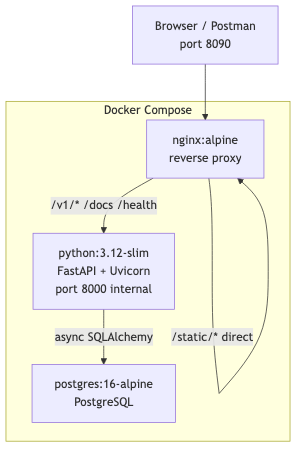
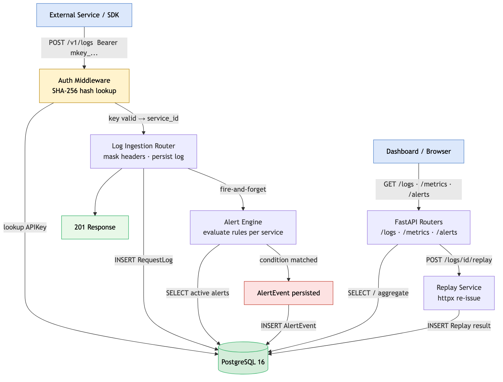
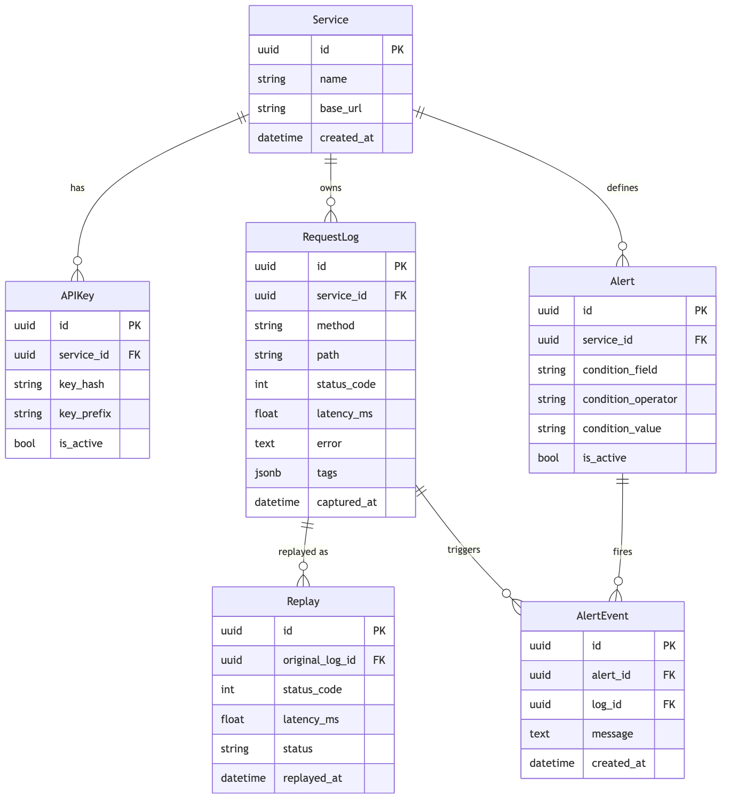

# API Monitor

A developer-first API monitoring and debugging platform. Point any service at the ingestion endpoint, and get a searchable log of every request and response, computed latency metrics, configurable threshold alerts, and one-click request replay — all in a self-hosted Docker stack.

---

## Contents

- [Overview](#overview)
- [Architecture](#architecture)
- [Prerequisites](#prerequisites)
- [Running the stack](#running-the-stack)
- [Getting started: first five minutes](#getting-started-first-five-minutes)
- [API reference](#api-reference)
  - [Services](#services)
  - [API keys](#api-keys)
  - [Logs](#logs)
  - [Metrics](#metrics)
  - [Alerts](#alerts)
- [Dashboard UI](#dashboard-ui)
- [Configuration](#configuration)
- [Project structure](#project-structure)
- [Data model](#data-model)

---

## Overview

Most teams discover API problems after users report them. API Monitor flips that: every request your service makes or receives can be pushed to the monitor in a single HTTP POST, stored in PostgreSQL, and surfaced through a queryable log and metrics dashboard.

Core capabilities:

- **Service registry with API key auth** — register a named service, receive a scoped API key, use that key to authenticate all ingestion and replay calls.
- **Structured request/response logging** — store method, URL, path, query params, request/response headers and bodies, status code, latency, error text, source IP, and free-form tags per log entry. Sensitive headers (`Authorization`, `Cookie`, `X-API-Key`, etc.) are masked automatically before storage.
- **Queryable log search** — filter by service, method, path (substring), status code, latency range, error presence, and tags; paginate with `limit`/`offset`.
- **Metrics aggregation** — total requests, error count and error rate, average latency, p95 latency, breakdown by HTTP method and status code; all computed in PostgreSQL.
- **Threshold alerts** — define rules (`status_code >= 500`, `latency_ms > 2000`, `error == true`) per service; rules are evaluated on every ingest and fire `AlertEvent` records when conditions are met.
- **Request replay** — re-issue any logged request via `httpx`, with optional URL, header, and body overrides; stores the replay result alongside the original for comparison.

---

## Architecture

### Deployment topology



### Request flow



| Component | Image / Runtime | Host port |
|-----------|----------------|-----------|
| `db` | postgres:16-alpine | — (internal) |
| `backend` | python:3.12-slim + FastAPI | 8000 (dev direct access) |
| `nginx` | nginx:alpine | **8090** |

Nginx routes `/v1/*`, `/docs`, `/redoc`, `/openapi.json`, and `/health` upstream to FastAPI. `/static/*` is served directly from the mounted frontend directory. All other paths fall through to FastAPI for HTML page serving.

> Images above are pre-rendered from the diagrams in `docs/`. They load in VS Code, GitHub, and any local markdown viewer.

---

## Prerequisites

- Docker >= 24
- Docker Compose v2 (`docker compose`, not `docker-compose`)

No local Python or Node installation required.

---

## Running the stack

```bash
git clone <repo-url>
cd api-monitor

docker compose up --build
```

The first start pulls images, builds the backend image, and waits for PostgreSQL to pass its healthcheck before starting the backend. SQLAlchemy creates all tables automatically on startup.

Once running:

- Dashboard: http://localhost:8090
- Interactive API docs: http://localhost:8090/docs
- Health check: http://localhost:8090/health

To stop:

```bash
docker compose down
```

To wipe the database volume:

```bash
docker compose down -v
```

---

## Getting started: first five minutes

### 1. Register a service

```bash
curl -s -X POST http://localhost:8090/v1/services \
  -H "Content-Type: application/json" \
  -d '{"name": "payments-api", "description": "Payment processing service", "base_url": "https://payments.internal"}' \
  | jq .
```

Response includes a `service_id` (UUID). Copy it.

### 2. Create an API key for that service

```bash
curl -s -X POST http://localhost:8090/v1/services/<service_id>/keys \
  -H "Content-Type: application/json" \
  -d '{"name": "prod-key"}' \
  | jq .
```

The response contains `raw_key` — a string starting with `mkey_`. This is shown **once only**. The backend stores only its SHA-256 hash.

### 3. Ingest a log entry

```bash
curl -s -X POST http://localhost:8090/v1/logs \
  -H "Authorization: Bearer mkey_<your-key>" \
  -H "Content-Type: application/json" \
  -d '{
    "method": "POST",
    "url": "https://payments.internal/charge",
    "path": "/charge",
    "status_code": 200,
    "latency_ms": 142.5,
    "request_headers": {"Content-Type": "application/json", "Authorization": "Bearer secret"},
    "request_body": "{\"amount\": 100}",
    "response_body": "{\"id\": \"ch_abc\"}"
  }' \
  | jq .
```

Note: `Authorization: Bearer secret` in the request headers will be stored as `***MASKED***`.

### 4. Query logs

```bash
# All logs for the service
curl "http://localhost:8090/v1/logs?service_id=<service_id>" | jq .

# Only 5xx responses
curl "http://localhost:8090/v1/logs?status_code=500" | jq .

# Slow requests
curl "http://localhost:8090/v1/logs?min_latency_ms=1000" | jq .
```

### 5. View metrics

```bash
curl "http://localhost:8090/v1/metrics?service_id=<service_id>" | jq .
```

### 6. Create an alert rule

```bash
curl -s -X POST http://localhost:8090/v1/alerts \
  -H "Content-Type: application/json" \
  -d '{
    "service_id": "<service_id>",
    "name": "High latency",
    "condition_field": "latency_ms",
    "condition_operator": ">=",
    "condition_value": "2000"
  }' \
  | jq .
```

Any subsequent log with `latency_ms >= 2000` will create an `AlertEvent` record.

### 7. Replay a past request

```bash
curl -s -X POST http://localhost:8090/v1/logs/<log_id>/replay \
  -H "Authorization: Bearer mkey_<your-key>" \
  -H "Content-Type: application/json" \
  -d '{}' \
  | jq .
```

Pass `override_url`, `override_headers`, or `override_body` to modify the request before re-issuing it.

---

## API reference

All endpoints are also available with interactive documentation at `/docs` (Swagger UI) and `/redoc`.

Base URL: `http://localhost:8090`

### Services

| Method | Path | Auth | Description |
|--------|------|------|-------------|
| POST | `/v1/services` | None | Create a service |
| GET | `/v1/services` | None | List all services |
| GET | `/v1/services/{service_id}` | None | Get a service by ID |

**Create service — request body:**

```json
{
  "name": "string (unique, max 128)",
  "description": "string (optional, max 512)",
  "base_url": "string (optional)"
}
```

---

### API keys

| Method | Path | Auth | Description |
|--------|------|------|-------------|
| POST | `/v1/services/{service_id}/keys` | None | Generate an API key for a service |
| GET | `/v1/services/{service_id}/keys` | None | List keys for a service (hashes only) |

**Create key — request body:**

```json
{ "name": "string (max 128)" }
```

**Create key — response includes `raw_key` once:**

```json
{
  "id": "uuid",
  "name": "prod-key",
  "key_prefix": "mkey_abc123",
  "raw_key": "mkey_<full-token>",
  "is_active": true,
  "created_at": "2026-04-02T10:00:00Z"
}
```

---

### Logs

| Method | Path | Auth | Description |
|--------|------|------|-------------|
| POST | `/v1/logs` | Bearer API key | Ingest a log entry |
| GET | `/v1/logs` | None | Query logs with filters |
| GET | `/v1/logs/{log_id}` | None | Get a single log with full detail |
| POST | `/v1/logs/{log_id}/replay` | Bearer API key | Replay a logged request |

**Ingest — request body fields:**

| Field | Type | Required | Notes |
|-------|------|----------|-------|
| `method` | string | Yes | Uppercased on store (GET, POST, …) |
| `url` | string | Yes | Full URL including scheme |
| `path` | string | Yes | Path component only |
| `status_code` | int | No | HTTP response status |
| `latency_ms` | float | No | Total round-trip in milliseconds |
| `query_params` | object | No | Key-value map |
| `request_headers` | object | No | Sensitive keys are masked |
| `request_body` | string | No | Raw body string |
| `response_headers` | object | No | Sensitive keys are masked |
| `response_body` | string | No | Raw body string |
| `error` | string | No | Error message if the call failed |
| `source_ip` | string | No | Client IP |
| `tags` | array of strings | No | Free-form labels for filtering |

**Query — available filters:**

| Query param | Type | Description |
|-------------|------|-------------|
| `service_id` | UUID | Filter by service |
| `method` | string | Exact match (case-insensitive) |
| `path` | string | Substring match |
| `status_code` | int | Exact match |
| `min_latency_ms` | float | Inclusive lower bound |
| `max_latency_ms` | float | Inclusive upper bound |
| `has_error` | bool | `true` = only logs with an error field set |
| `tag` | string | Logs containing this tag |
| `limit` | int | Default 50, max 500 |
| `offset` | int | Default 0 |

**Replay — request body:**

```json
{
  "override_url": "string (optional)",
  "override_headers": {"key": "value"},
  "override_body": "string (optional)"
}
```

Unset fields fall back to the original log values. The replay result records the new status code, response body, response headers, latency, and a `status` field (`success` or `failed`).

---

### Metrics

| Method | Path | Auth | Description |
|--------|------|------|-------------|
| GET | `/v1/metrics` | None | Aggregate metrics, optionally scoped to a service |

**Query params:** `service_id` (UUID, optional)

**Response:**

```json
{
  "total_requests": 1240,
  "error_count": 37,
  "error_rate": 0.0298,
  "avg_latency_ms": 183.4,
  "p95_latency_ms": 612.0,
  "by_method": {"GET": 900, "POST": 340},
  "by_status": {"200": 1100, "404": 103, "500": 37}
}
```

`p95_latency_ms` is computed with PostgreSQL's `percentile_cont(0.95)`.

---

### Alerts

| Method | Path | Auth | Description |
|--------|------|------|-------------|
| POST | `/v1/alerts` | None | Create an alert rule |
| GET | `/v1/alerts` | None | List alert rules |
| GET | `/v1/alerts/{alert_id}` | None | Get a single alert rule |
| DELETE | `/v1/alerts/{alert_id}` | None | Delete an alert rule |
| GET | `/v1/alerts/{alert_id}/events` | None | List fired events for a rule |

**Create alert — request body:**

```json
{
  "service_id": "uuid",
  "name": "string",
  "description": "string (optional)",
  "condition_field": "status_code | latency_ms | error",
  "condition_operator": ">= | <= | == | != | > | <",
  "condition_value": "string (coerced to field type)"
}
```

Alert evaluation happens synchronously on every log ingest. Errors during evaluation are swallowed so a broken alert rule never blocks ingestion.

---

## Dashboard UI

The frontend is a set of plain HTML/CSS/JavaScript pages served by FastAPI. No build step required.

| URL | Page |
|-----|------|
| `/` | Service list — register services and manage API keys |
| `/dashboard` | Log table with live filters (service, method, status, path, error, latency) |
| `/log/<log_id>` | Full log detail: request, response, headers, body, tags |
| `/metrics-ui` | Metrics overview: totals, latency, breakdown charts |
| `/alerts-ui` | Alert rule management and fired event history |
| `/replay/<log_id>` | Replay interface: override fields, submit, compare result |

---

## Configuration

Environment variables read by the backend (set in `docker-compose.yml` or a `.env` file):

| Variable | Default | Description |
|----------|---------|-------------|
| `DATABASE_URL` | `postgresql+asyncpg://monitor:monitor@db:5432/apimonitor` | Async SQLAlchemy DSN |
| `DATABASE_SYNC_URL` | `postgresql+psycopg2://...` | Sync DSN (used by Alembic) |
| `SECRET_KEY` | `change-me-in-production-please` | Application secret — change before any real deployment |
| `DEBUG` | `false` | Enables Uvicorn `--reload` and verbose output |
| `FRONTEND_DIR` | `../frontend` | Path to the built frontend directory |

The database user, password, and database name are set via standard PostgreSQL environment variables on the `db` service:

```yaml
POSTGRES_USER: monitor
POSTGRES_PASSWORD: monitor
POSTGRES_DB: apimonitor
```

---

## Project structure

```
api-monitor/
├── backend/
│   ├── Dockerfile
│   ├── requirements.txt
│   └── app/
│       ├── main.py              # FastAPI app, router registration, static file serving
│       ├── config.py            # Pydantic settings
│       ├── database.py          # Async engine, session factory, Base
│       ├── middleware/
│       │   └── auth.py          # Bearer API key dependency (SHA-256 hash lookup)
│       ├── models/
│       │   ├── service.py       # Service table
│       │   ├── api_key.py       # APIKey table (hash + prefix stored, raw never persisted)
│       │   ├── request_log.py   # RequestLog table
│       │   ├── alert.py         # Alert rule table
│       │   ├── alert_event.py   # AlertEvent table (fired instances)
│       │   └── replay.py        # Replay result table
│       ├── routers/
│       │   ├── services.py      # /v1/services + /v1/services/{id}/keys
│       │   ├── logs.py          # /v1/logs + /v1/logs/{id}/replay
│       │   ├── metrics.py       # /v1/metrics
│       │   └── alerts.py        # /v1/alerts + /v1/alerts/{id}/events
│       ├── schemas/             # Pydantic v2 request/response models
│       ├── services/
│       │   ├── alert_engine.py  # Threshold evaluation on ingest
│       │   └── replay_service.py # httpx re-issue + result storage
│       └── utils/
│           └── masking.py       # Sensitive header masking
├── frontend/
│   ├── index.html
│   ├── dashboard.html
│   ├── log-detail.html
│   ├── metrics.html
│   ├── alerts.html
│   ├── replay.html
│   └── static/                  # CSS, JS
├── docker-compose.yml
├── nginx.conf
├── init.sql                     # Seeding hook (tables created by SQLAlchemy)
└── OJT_PRD.md
```

---

## Data model



All primary keys are UUID. Foreign keys cascade on delete: removing a service removes its keys, logs, alerts, and all derived records.
